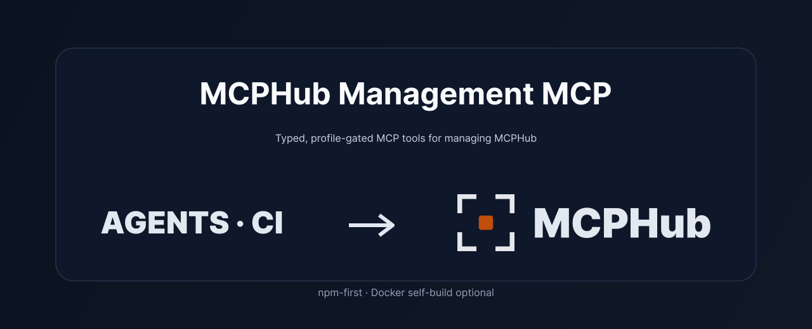
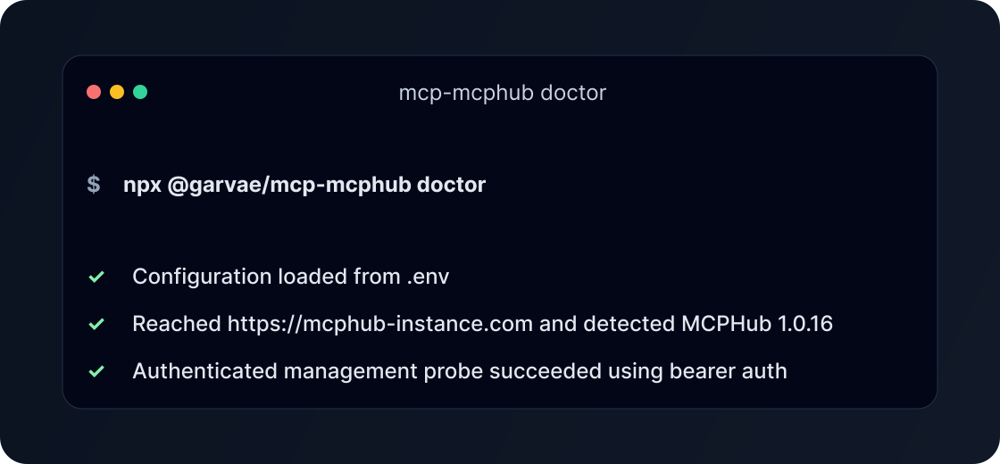
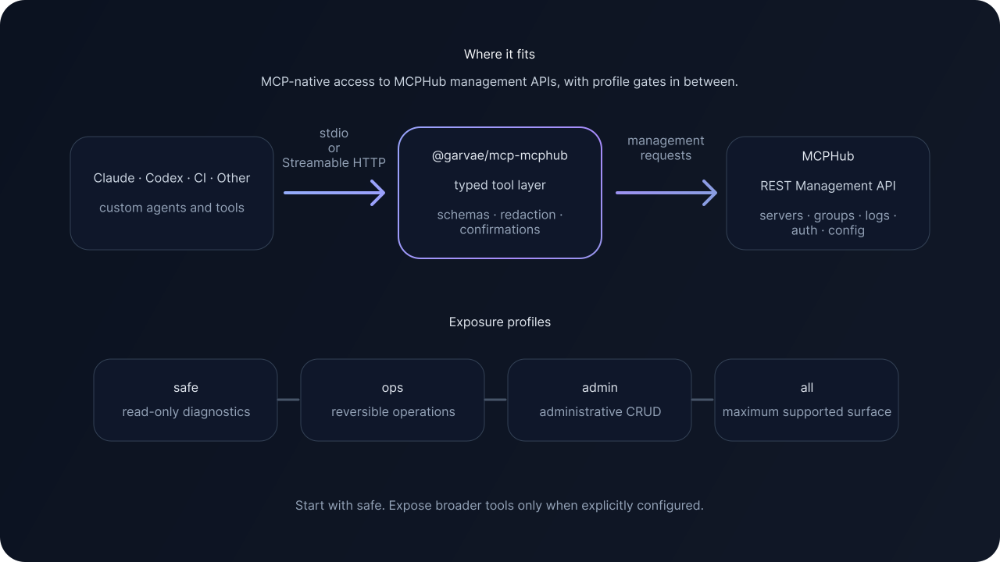

<!-- markdownlint-disable MD033 MD041 -->
<p align="center">
  
</p>

<h1 align="center">MCPHub Management MCP</h1>

<p align="center">
  Typed, profile-gated MCP tools for managing self-hosted MCPHub instances through the REST Management API.
</p>

<p align="center">
  <a href="#quick-start">Quick Start</a>
  ·
  <a href="https://github.com/samanhappy/mcphub">MCPHub</a>
  ·
  <a href="https://docs.mcphub.app/">MCPHub Docs</a>
  ·
  <a href="./docs/tools.md">Tools</a>
  ·
  <a href="./docs/security.md">Security</a>
  ·
  <a href="./CONTRIBUTING.md">Contribute</a>
</p>
<!-- markdownlint-enable MD033 MD041 -->

[](./LICENSE)
[](./package.json)
[](https://github.com/garvae/mcp-mcphub/actions/workflows/ci.yml)
[](https://github.com/garvae/mcp-mcphub/actions/workflows/coverage.yml)
[](https://github.com/garvae/mcp-mcphub/actions/workflows/compatibility-matrix.yml)
[](https://github.com/garvae/mcp-mcphub/actions/workflows/repo-guardrails.yml)

`@garvae/mcp-mcphub` turns [MCPHub][mcphub]'s REST Management API into typed, profile-gated MCP tools, so agents and operators can inspect, operate, and maintain MCPHub without hand-written REST calls.

MCPHub is the upstream hub this package manages; see the [MCPHub docs][mcphub-docs], [API reference][mcphub-api], and [CLI docs][mcphub-cli].

Use it when you want Claude, Codex, CI, or internal automation to manage MCPHub through MCP-native tools while keeping dangerous operations behind profiles, confirmations, and feature flags.

It is an independent, unofficial, community-maintained package. It manages MCPHub itself. It does not replace MCPHub, and it does not replace MCPHub's downstream `/mcp` gateway endpoints.

## At a Glance

| Capability              | What it means                                                 |
| ----------------------- | ------------------------------------------------------------- |
| Typed MCP tools         | MCPHub management APIs exposed as structured `mcphub_*` tools |
| Profile-gated access    | `safe`, `ops`, `admin`, `all` surfaces                        |
| Agent-friendly catalogs | generated Markdown and JSON tool catalogs                     |
| Route coverage          | MCPHub API coverage matrix and drift checks                   |
| Safe defaults           | redaction, confirmations, dangerous feature flags off         |
| npm-first               | local `npx` / `stdio` by default                              |

## Quick Start

This example shows the smallest local setup: one MCP client launches this package over `stdio` with the `safe` exposure profile.

For HTTP mode, Docker/self-build deployments, shared gateways, or MCP manager setups, see [runtime modes][runtime-modes], [Streamable HTTP][http-docs], and [shared gateway integration][managed-gateway].

### 1. Start with a running MCPHub instance

You need a running [MCPHub][mcphub] instance first. This package manages MCPHub; it does not install or replace MCPHub.

Use your MCPHub base URL as `MCPHUB_URL`, for example `https://mcphub-site.com`. If you are still setting up MCPHub itself, start with the [upstream docs][mcphub-docs] or the [upstream repository][mcphub].

### 2. Create an MCPHub management credential

Create a management credential in MCPHub. For unattended local or CI usage, the recommended first credential is a system-level bearer key with management access.

Upstream MCPHub CLI example:

```bash
mcphub login --url https://mcphub-site.com --username admin
mcphub keys create --name mcp-mcphub --access-type all
```

Copy the generated token when MCPHub prints it. Use that token as `MCPHUB_TOKEN`.

If your deployment uses another auth flow, see [auth modes][auth-modes], [getting started][getting-started], and the [upstream CLI docs][mcphub-cli].

### 3. Put the variables where your client can read them

Set these values either:

- in your shell before running the CLI;
- in a local `.env` file;
- directly in your MCP client config;
- in your MCP manager or shared gateway environment.

The shell examples below are only one option. See [minimal config][minimal-config], [full configuration][configuration], and [managed gateway integration][managed-gateway].

Example shell setup:

### Bash

```bash
export MCPHUB_URL="https://mcphub-site.com"
export MCPHUB_TOKEN="REPLACE_ME"

npx @garvae/mcp-mcphub doctor
npx @garvae/mcp-mcphub stdio --exposure=safe
```

### PowerShell

```powershell
$env:MCPHUB_URL = "https://mcphub-site.com"
$env:MCPHUB_TOKEN = "REPLACE_ME"

npx @garvae/mcp-mcphub doctor
npx @garvae/mcp-mcphub stdio --exposure=safe
```

Example local `.env` for `stdio`:

```dotenv
MCPHUB_URL=https://mcphub-site.com
MCPHUB_TOKEN=REPLACE_ME
```

### 4. Run doctor before connecting the client

Run `doctor` first to verify that config loads, MCPHub is reachable, and the management credential is accepted. Use `doctor --json` when you need machine-readable diagnostics or CI-friendly output.

<!-- markdownlint-disable MD033 -->
<p align="center">
  
</p>
<!-- markdownlint-enable MD033 -->

The preview is illustrative. For troubleshooting details, see [troubleshooting][troubleshooting] and [getting started][getting-started].

### 5. Connect one local MCP client over `stdio`

For one local client, `stdio` is the smallest setup: no HTTP listener, no reverse proxy, and no inbound MCP token.

Claude Desktop / Claude Code style example:

```json
{
  "mcpServers": {
    "mcphub-safe": {
      "type": "stdio",
      "command": "npx",
      "args": ["-y", "@garvae/mcp-mcphub", "stdio", "--exposure=safe"],
      "env": {
        "MCPHUB_URL": "https://mcphub-site.com",
        "MCPHUB_TOKEN": "REPLACE_ME"
      }
    }
  }
}
```

See [stdio mode][stdio-docs], [getting started][getting-started], and [runtime modes][runtime-modes].

Using HTTP instead of `stdio`? You will also need an inbound MCP token such as `MCP_HTTP_AUTH_TOKEN`. See [Streamable HTTP][http-docs].

HTTP-only addition:

```dotenv
MCP_HTTP_AUTH_TOKEN=REPLACE_ME_SAFE_TOKEN
```

`MCP_HTTP_AUTH_TOKEN` and `MCP_HTTP_AUTH_TOKENS_JSON` are only for HTTP mode. They are not required for normal local `stdio`.

## What This Is

- Typed MCP tools for MCPHub management
- CLI-first runtime with `stdio` and Streamable HTTP transports
- Exposure-profile filtering for safer agent access
- Structured schemas, confirmations, and redaction defaults

## What This Is Not

- Not official MCPHub
- Not MCPHub itself
- Not a replacement for downstream `/mcp` gateway endpoints
- Not a generic arbitrary HTTP proxy
- Not a replacement for MCPHub UI, CLI, or deployment tooling

## How It Fits

<!-- markdownlint-disable MD033 -->
<p align="center">
  
</p>
<!-- markdownlint-enable MD033 -->

Clients connect to this package through `stdio` or Streamable HTTP, depending on whether they run locally or through a shared service. The package exposes typed `mcphub_*` tools instead of raw HTTP calls, so schemas, confirmations, and redaction rules stay consistent across clients. Exposure profiles decide which tools are actually available at runtime. Upstream operations are executed through the MCPHub REST Management API.

## Why Use It

- Let Claude, Codex, CI, or trusted automation manage MCPHub through MCP tools
- Avoid ad-hoc REST calls and client-specific wrappers
- Work with typed schemas instead of free-form request payloads
- Start with `safe`, then raise exposure only when needed
- Keep destructive surfaces behind confirmations and feature flags
- Use generated tool catalogs and route coverage exports for static analysis

## Common Use Cases

- Inspect MCPHub health, config, servers, groups, logs, and activity.
- Let an AI coding agent list available MCPHub servers and explain the current setup.
- Reload or toggle servers through an `ops` profile without exposing full admin tools.
- Manage groups, prompts, resources, and server definitions through trusted admin workflows.
- Compare MCPHub route coverage against upstream changes.
- Generate AI-readable tool catalogs for static planning and reviews.

## Requirements

- Node.js `22.13+` (Node 22 LTS baseline; Node 24 also supported)
- A reachable MCPHub instance
- An MCPHub management credential
- Recommended first credential: a system-level bearer key with suitable management access
- `pnpm` is required for development, not for normal `npx` usage

## Official MCPHub Links

- Official repository: [samanhappy/mcphub][mcphub]
- Official documentation: [docs.mcphub.app][mcphub-docs]
- Official API reference: [docs.mcphub.app/api-reference/introduction][mcphub-api]
- Official AI-readable docs index: [docs.mcphub.app/llms.txt][mcphub-llms]
- Official CLI and key-management examples: [MCPHub CLI docs][mcphub-cli]

## Token Model

- `MCPHUB_TOKEN` authenticates this package to upstream MCPHub
- `MCP_HTTP_AUTH_TOKEN` or `MCP_HTTP_AUTH_TOKENS_JSON` authenticates inbound HTTP MCP clients to this package
- `MCP_HTTP_*` auth tokens are local to this package and are needed only for HTTP mode

For manual upstream bearer validation, prefer a normal management endpoint such as `GET /api/servers`. Do not use `GET /api/auth/keys` as the first bearer smoke check on older MCPHub versions.

## Client Examples

### Claude Desktop / Claude Code style `stdio`

```json
{
  "mcpServers": {
    "mcphub-safe": {
      "type": "stdio",
      "command": "npx",
      "args": ["-y", "@garvae/mcp-mcphub", "stdio", "--exposure=safe"],
      "env": {
        "MCPHUB_URL": "https://mcphub-site.com",
        "MCPHUB_TOKEN": "REPLACE_ME"
      }
    }
  }
}
```

### Codex TOML

```toml
[mcp_servers.mcphub_safe]
command = "npx"
args = ["-y", "@garvae/mcp-mcphub", "stdio", "--exposure=safe"]
env_vars = ["MCPHUB_URL", "MCPHUB_TOKEN"]
startup_timeout_sec = 20
tool_timeout_sec = 90
enabled = true
```

### Short HTTP example

```bash
export MCPHUB_URL="https://mcphub-site.com"
export MCPHUB_TOKEN="REPLACE_ME"
export MCP_HTTP_AUTH_TOKEN="REPLACE_ME_SAFE_TOKEN"

npx @garvae/mcp-mcphub http
```

See [Streamable HTTP][http-docs] for full HTTP configuration, reverse-proxy guidance, and client auth mapping.

## Runtime Modes

- `stdio`: best default for local MCP clients
- Streamable HTTP: for shared internal services, CI, reverse proxies, and self-hosted deployments
- Docker: optional self-build only

Docker is optional. The official distribution channel is npm; Docker examples are provided for users who want to build and run their own container image.

## Exposure Profiles

| Profile | Intended use                         | Notes            |
| ------- | ------------------------------------ | ---------------- |
| `safe`  | read-only diagnostics and inventory  | start here       |
| `ops`   | reversible operational changes       | includes `safe`  |
| `admin` | administrative CRUD                  | includes `ops`   |
| `all`   | maximum supported management surface | includes `admin` |

Use the smallest profile that works. Dangerous feature-flagged surfaces stay disabled by default. Runtime `tools/list` is the final source of truth for what a client can actually access.

## Supported Areas

| Area                             | Coverage examples                                             |
| -------------------------------- | ------------------------------------------------------------- |
| Platform and health              | health checks, public config, runtime config                  |
| Inventory and diagnostics        | servers, groups, discovery, logs, activity                    |
| Servers                          | server CRUD, reloads, toggles, descriptions                   |
| Groups                           | group CRUD and membership                                     |
| Logs and activity                | operational visibility and summaries                          |
| Auth and identity                | current user, bearer keys, OAuth clients, user management     |
| Templates and config             | settings snapshots, templates, system config                  |
| Market, cloud, registry, OpenAPI | where upstream management routes are supported and classified |

## Tool Catalogs and API Coverage

- Curated overview: [docs/tools.md][tools-docs]
- Generated catalog index: [docs/generated/README.md][generated-catalogs]
- `safe` catalog: [docs/generated/tools.safe.md](./docs/generated/tools.safe.md)
- `ops` catalog: [docs/generated/tools.ops.md](./docs/generated/tools.ops.md)
- `admin` catalog: [docs/generated/tools.admin.md](./docs/generated/tools.admin.md)
- `all` catalog: [docs/generated/tools.all.md](./docs/generated/tools.all.md)
- Generated JSON catalogs:
  - [docs/generated/tools.safe.json](./docs/generated/tools.safe.json)
  - [docs/generated/tools.ops.json](./docs/generated/tools.ops.json)
  - [docs/generated/tools.admin.json](./docs/generated/tools.admin.json)
  - [docs/generated/tools.all.json](./docs/generated/tools.all.json)
- Route coverage matrix: [docs/api-coverage.md][api-coverage]
- Machine-readable coverage export: [docs/generated/api-coverage.json](./docs/generated/api-coverage.json)

Generated JSON catalogs are useful for AI agents, static planning, and automated analysis.

## Built for Safe Agent Operations

MCPHub management is powerful: it can affect servers, groups, users, keys, logs, templates, and system config. This package exposes that power through profiles, confirmations, feature flags, and generated catalogs so agents can start read-only and only receive broader capabilities when explicitly configured.

## For AI Agents

Start with [docs/for-ai-agents.md][ai-agents].
Use generated JSON catalogs for static planning.
Use runtime `tools/list` as the final source of truth for exact schemas available to a selected profile.
Do not assume `admin` or `all` tools are exposed unless the profile and feature flags allow them.

## Security at a Glance

| Control                          | Current behavior                                                                                                                         |
| -------------------------------- | ---------------------------------------------------------------------------------------------------------------------------------------- |
| Exposure profiles                | server-side profile filtering                                                                                                            |
| Secret redaction                 | enabled by default                                                                                                                       |
| Destructive actions              | structured confirmations                                                                                                                 |
| Dangerous surfaces               | feature-flagged and off by default                                                                                                       |
| HTTP auth                        | required in HTTP mode                                                                                                                    |
| Host and origin validation       | enforced in HTTP mode                                                                                                                    |
| Request limits and rate limiting | enforced in HTTP mode                                                                                                                    |
| Audit logging                    | optional and off unless configured                                                                                                       |
| SSRF protection                  | recursive URL-field checks, HTTP/HTTPS-only validation, localhost/private-network blocking; DNS-based SSRF protection is not implemented |
| Security reporting               | follow [SECURITY.md][security-policy]                                                                                                    |

Read-only endpoints may still expose operationally sensitive information even after redaction. Review [docs/security.md][security-docs] before exposing anything beyond local trusted use.

## Community

This project is useful only if it stays aligned with real MCPHub deployments and real MCP client workflows.

Contributions are welcome in areas such as:

- adding and improving tests, especially around auth, exposure profiles, redaction, SSRF validation, HTTP transport, and package install behavior
- responsible security research, threat-model review, and hardening PRs
- testing against new MCPHub versions
- improving Claude, Codex, and other client setup examples
- expanding route coverage when upstream MCPHub adds APIs
- improving generated tool descriptions
- adding examples for real-world self-hosted deployments
- improving troubleshooting and diagnostics
- reporting API drift or compatibility issues

If you run MCPHub in a different environment, use a different MCP client, or hit upstream API drift, your reports and examples are especially valuable.

### Good First Contributions

- Improve docs for a client you use.
- Add a troubleshooting note for a setup failure you hit.
- Improve examples with safer placeholders.
- Report upstream MCPHub compatibility drift.
- Improve generated tool descriptions or risk notes.
- Add regression tests around a small tool group, redaction rule, or exposure-profile boundary.

### Help Wanted

The most valuable help is:

- compatibility reports for MCPHub versions not yet covered
- real-world MCP client config examples
- security research for SSRF, token leakage, prompt or description injection, HTTP auth edge cases, and profile-boundary bypasses
- route coverage updates when upstream MCPHub changes
- tests for `stdio`, Streamable HTTP, and package install behavior

Recommended maintainer labels for public triage:

- `good first issue`
- `help wanted`
- `documentation`
- `compatibility`
- `upstream-drift`
- `security`
- `client-config`
- `tool-catalog`
- `testing`

## Support the Project

If `@garvae/mcp-mcphub` saves you time managing MCPHub, consider supporting ongoing maintenance through [GitHub Sponsors][github-sponsors] or [Ko-fi][ko-fi].

Sponsorship helps fund compatibility testing, documentation, security hardening, and support for new MCPHub releases.

Code, docs, bug reports, compatibility reports, and security feedback are just as valuable as financial support.

## Troubleshooting First Run

- Run `npx @garvae/mcp-mcphub doctor`
- Run `npx @garvae/mcp-mcphub doctor --json` for machine-readable diagnostics
- Unauthorized usually means the wrong upstream credential, auth header, or credential scope
- Connection failures usually mean the wrong `MCPHUB_URL` or an unreachable MCPHub instance
- HTTP `401` usually means the wrong local inbound HTTP token

See [docs/troubleshooting.md][troubleshooting].

## Documentation Map

| Need                       | Document                                                                              |
| -------------------------- | ------------------------------------------------------------------------------------- |
| First run                  | [docs/getting-started.md][getting-started]                                            |
| Minimal config             | [docs/minimal-config.md][minimal-config]                                              |
| Full config                | [docs/configuration.md][configuration]                                                |
| `stdio` mode               | [docs/stdio.md][stdio-docs]                                                           |
| Streamable HTTP            | [docs/streamable-http.md][http-docs]                                                  |
| Runtime mode selection     | [docs/runtime-modes.md][runtime-modes]                                                |
| Docker and deployment      | [docs/deployment.md](./docs/deployment.md)                                            |
| Tools overview             | [docs/tools.md][tools-docs]                                                           |
| Generated catalogs         | [docs/generated/README.md][generated-catalogs]                                        |
| API coverage               | [docs/api-coverage.md][api-coverage]                                                  |
| Security                   | [docs/security.md][security-docs]                                                     |
| Testing                    | [docs/testing.md](./docs/testing.md)                                                  |
| Compatibility              | [docs/compatibility.md](./docs/compatibility.md)                                      |
| Upstream relationship      | [docs/upstream-mcphub.md](./docs/upstream-mcphub.md)                                  |
| Shared gateway integration | [docs/managed-gateway-integration.md][managed-gateway]                                |
| AI agents                  | [docs/for-ai-agents.md][ai-agents]                                                    |
| Troubleshooting            | [docs/troubleshooting.md][troubleshooting]                                            |
| Roadmap direction          | [ROADMAP.md][roadmap]                                                                 |
| Release and contribution   | [docs/release-process.md](./docs/release-process.md), [CONTRIBUTING.md][contributing] |

## Support and Contribution

- Questions and setup help: see [SUPPORT.md][support]; use Discussions when they are enabled
- Reproducible bugs: use the bug report issue template
- Feature proposals: use the feature request template
- Upstream route or compatibility drift: use the compatibility template
- Security issues: follow [SECURITY.md][security-policy] and avoid public disclosures with sensitive details
- Pull requests: read [CONTRIBUTING.md][contributing]
- Contributor and agent notes: [AGENTS.md][agents-notes]

Do not post tokens, cookies, client secrets, private URLs, or sensitive production logs publicly.

## Installation

No-install local run:

```bash
npx @garvae/mcp-mcphub doctor
npx @garvae/mcp-mcphub stdio --exposure=safe
```

Optional global install:

```bash
pnpm add -g @garvae/mcp-mcphub
```

## License

Apache-2.0. See [LICENSE][license].

<!-- Link references -->

[mcphub]: https://github.com/samanhappy/mcphub
[mcphub-docs]: https://docs.mcphub.app/
[mcphub-api]: https://docs.mcphub.app/api-reference/introduction
[mcphub-cli]: https://docs.mcphub.app/features/cli
[mcphub-llms]: https://docs.mcphub.app/llms.txt
[github-sponsors]: https://github.com/sponsors/garvae
[ko-fi]: https://ko-fi.com/garvae
[tools-docs]: ./docs/tools.md
[generated-catalogs]: ./docs/generated/README.md
[api-coverage]: ./docs/api-coverage.md
[security-docs]: ./docs/security.md
[getting-started]: ./docs/getting-started.md
[minimal-config]: ./docs/minimal-config.md
[configuration]: ./docs/configuration.md
[auth-modes]: ./docs/auth-modes.md
[stdio-docs]: ./docs/stdio.md
[http-docs]: ./docs/streamable-http.md
[runtime-modes]: ./docs/runtime-modes.md
[managed-gateway]: ./docs/managed-gateway-integration.md
[ai-agents]: ./docs/for-ai-agents.md
[troubleshooting]: ./docs/troubleshooting.md
[contributing]: ./CONTRIBUTING.md
[support]: ./SUPPORT.md
[security-policy]: ./SECURITY.md
[agents-notes]: ./AGENTS.md
[roadmap]: ./ROADMAP.md
[license]: ./LICENSE
